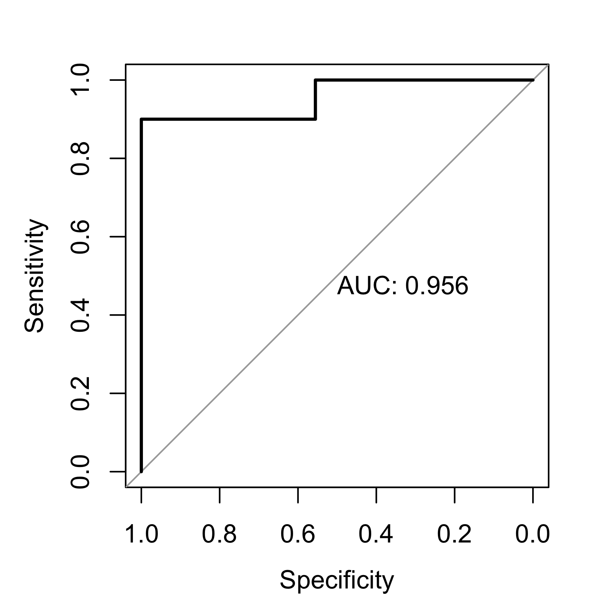

<!-- README.md is generated from README.Rmd. -->
An easy template for the basic tindeResting app

Overview
--------

The tinderesting concept is analoguous to the recaptcha concept. The reviewer receives an image, the image is scored (in this case as interesting or not) and this information is used to train a machine learning model. Specifically a random forest model is trained, which is (hopefully) capable of emulating the decision process of the researcher.

In the corresponding tinderesting paper, the example deals with data analysis for dynamic (longitudinal/time-resolved) metabolomics data. However, to illustrate the general idea in a less convoluted way, let's look at some flowers.

Installation
------------

The template itself is simply an R script, so there is no need to install, simply download it. However, there are a few packages required to run the shiny app:

``` r
#install.packages("shiny")
#install.packages("shinysense")
#install.packages("ggplot2")
#install.packages("randomForest")
#install.packages("stats")
#install.packages("DBI")
#install.packages("RSQLite")
#install.packages("caret") # not required but used in this README

library(shiny)
library(shinysense)
library(ggplot2)
library(randomForest)
library(stats)
library(DBI)
library(RSQLite)

require(magick)
```

The magick packages (used by the tinderesting template app) requires not only the installation of the package but also the ImageMagick software which can be found on imagemagick.org.

Flowers
-------

Suppose we have a friend named Djoffert. Djoffert is very interested in roses but hates calendula flowers. He has received an old computer from his friend Benny which is filled with images of, you guessed it, roses and calendula flowers. Djoffert would like to find as much as possible roses, without having too look at all the calendula flowers.

<center>
   
</center>
<p style="text-align: center; font-style: italic;">
Djoffert likes the roses on the left but hates the calendula on the right
</p>
To achieve this, clever Djoffert is going to use tinderesting. In the data folder there is a subfolder containing images of both flowers (This is a subset of the Kaggle flower dataset from Olga Belitskaya <https://www.kaggle.com/olgabelitskaya/flower-color-images/home>). Also in the data folder we find a .csv file containing the corresponding flower type for each images.

Djoffert's plan can be outlined as follows:

-   review half of the images with tinderesting (the training dataset, images need to be in the **data/tinderesting\_images** folder),
-   construct a random forest model based on the training data,
-   evaluate the performance on the other half of the images (testing data),
-   if the model is performant enough, use it on Benny's computer (this step is not actually done since Benny's computer is made up).

### Step 0: training and testing data

Put the images to be used in tinderesting in the **data/tinderesting\_images** folder.

``` r
# create and clean the dirs
set.seed(1)

dir.create("data/tinderesting_images")
file.remove(list.files("data/tinderesting_images", full.names = TRUE))

dir.create("data/flowertesting")
file.remove(list.files("data/flowertesting", full.names = TRUE))

flowers_meta <- read.csv2(file = "data/all_flower_labels.csv")

trainIndex <-  caret::createDataPartition(flowers_meta$name, p = .5, 
                                          list = FALSE, 
                                          times = 1)

flowers_meta$train = FALSE
flowers_meta$train[trainIndex] = TRUE


file.copy(from = paste("data/all_flowers/",flowers_meta$file[flowers_meta$train == TRUE],sep = ""), 
          to = "data/tinderesting_images")
file.copy(from = paste("data/all_flowers/",flowers_meta$file[flowers_meta$train == FALSE],sep = ""), 
          to = "data/flowertesting")
```

### Step 1: run tinderesting

Next we run the Shiny app and review the images. (This has been done already offline)

``` r
file.remove("swiperespons.sqlite")

## tinderesting step 2: review images
shiny::runApp("app.R")
```

### Step 2: train machine learning model

Now we get the results from tinderesting, which are stored in an sqlite file, and train the random forest model.

It is important to note that the random forest model is not trained on the raw images. Rather, the randomm forest model receives the histograms of the red, green and blue layers (20 bins each).

``` r

sqlitePath <- "swiperespons.sqlite"
db <- DBI::dbConnect(RSQLite::SQLite(), sqlitePath)
swipeData = DBI::dbReadTable(db,"swipes")
DBI::dbDisconnect(db)

## tinderesting step 3: train random forest model 

### first we remove the up swipes, these are uncertain revisions
### Also, here you can select only your own swipes (filter on user)

swipeData <- swipeData[swipeData$swipe != "Up",]

### next we match the reviewed file to the correct data entry
file_review_match <- match(swipeData$file, flowers_meta$file )

### Now lets train the random forest model. For this the input is not the raw images, that would be moronic. 
### Rather we insert the RBG histograms

test <- png::readPNG(list.files("data/tinderesting_images", full.names = TRUE)[1], native = FALSE, info = FALSE)[,,1:3]
RBG_data <- c(hist(test[,,1], breaks = seq(0,1,0.05), plot = FALSE)[["counts"]],
              hist(test[,,2], breaks = seq(0,1,0.05), plot = FALSE)[["counts"]],
              hist(test[,,3], breaks = seq(0,1,0.05), plot = FALSE)[["counts"]])

All_RBGdata <- matrix(0, ncol = length(RBG_data), nrow = nrow(flowers_meta))

for(k in seq_along(flowers_meta$file)){
    flower <- png::readPNG(paste("data/all_flowers/",flowers_meta$file[k],sep=""), native = FALSE, info = FALSE)[,,1:3]
    
    All_RBGdata[k,] <- c(hist(flower[,,1], breaks = seq(0,1,0.05), plot = FALSE)[["counts"]],
                         hist(flower[,,2], breaks = seq(0,1,0.05), plot = FALSE)[["counts"]],
                         hist(flower[,,3], breaks = seq(0,1,0.05), plot = FALSE)[["counts"]])
}

train_RBG = All_RBGdata[file_review_match,]
test_RBG = All_RBGdata[flowers_meta$train == FALSE,]

RF_model <- randomForest::randomForest(x = train_RBG, 
                                       y = as.factor(swipeData$swipe == "Right"))
```

### Step 3: training and testing data

Now let's evaluate the performance on the testing data.

``` r

## Now let's evaluate the performance

### First, we obtain the probabilities for the test set
predicted_probs <- stats::predict(object = RF_model, 
                                  newdata = test_RBG, 
                                  type = "prob")[,2]

### Now we use the known ground truth to check the performance of the model we trained with tinderesting

test_labels = flowers_meta$name[flowers_meta$train == FALSE]

flower_auc <- pROC::roc(response = test_labels, 
                        predictor = predicted_probs,
                        plot = TRUE, 
                        print.auc = TRUE)
```



Djoffert's model is performing extremely well. The roc curve has an auc value of 0.967, a near perfect model. So the random forest model has learned to distinguis red and yellow roses from the orange calendula flowers.
